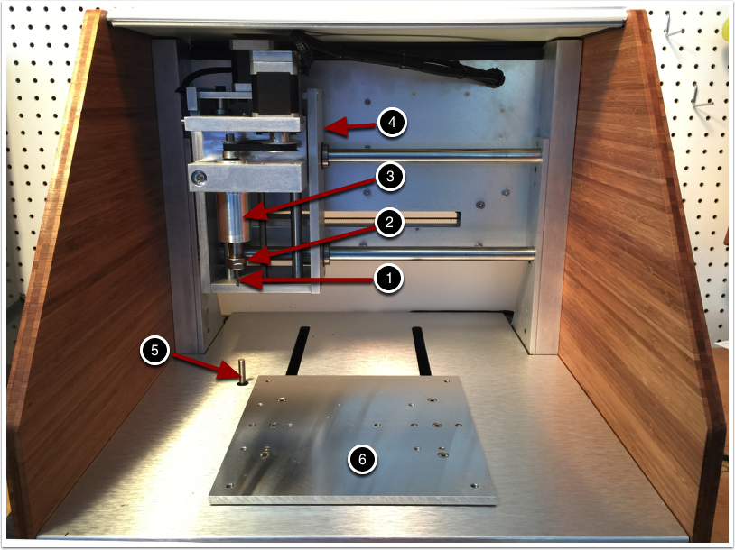

= Machine Basics

=== Machine Diagrams

=== Machine Specifications

=== Changing The Bit and Collet

=== Toolchain Basics

Before we cover the basics of Carbide Create, it’s useful to know what’s happening behind the scenes from a software standpoint. If you’re a seasoned pro at CNC you can probably safely skip this section. While similar in principal to many other digital fabrication tools like 3D printers or laser cutters, building something on the Nomad883 isn’t as simple as inserting a file into a program and telling the machine to print it. Before carving on a rotary CNC machine like the Nomad883, one must consider the material to be cut, the type of milling bit doing the cutting, as well as how the material is being clamped to the work-holding surface; in this case the wasteboard that comes with your Nomad883. When designing the basic model to be cut, and when creating the cutting paths themselves one must always keep in mind the eventual practical considerations that come with having a physical carving system with a moving cutting head.

**Design**

Much like technical drawing, a digital design is a pattern that gives lengths, widths, and other dimensions of a part to be produced. In the context of 3D carving, this can take the form of a 2-dimensional vector file or a 3D solid mesh file. Much like a technical drawing, a digital design file contains very little information on how the actual part is going to be produced by a machine. This allows a single design to be manufactured in any number of ways depending on the bit, material, etc. for 2D work we generally recommend starting with a program like Inkscape or Adobe Illustrator as they allow for effective manipulation of complex vectors. Carbide Create has some limited vector editing capabilities as well as some very useful apps for creating boxes, gears, etc., but for general purpose work, a dedicated program is ideal. Designing and carving 3D objects is a more advanced topic which we’ll touch upon here only briefly. Generally any CAD program capable of exporting a .stl mesh file will work nicely for 3D design.

**CAM/Toolpath Generation**

Once the basic design has been worked out, we must use a program to determine how the design will be interpreted as cutting path. To do this we must know what sort of bit we will be cutting with as well as the proper feed rates and cutting depths that are appropriate to both the material being cut and the bit doing the cutting. These values can be entered in Carbide Create or any other compatible CAM software that you may be using. Carbide Create makes the process of selecting feed rate and pass depth relatively simple with its suggested values for various materials. These values tend toward the conservative side, though sometimes you may need to alter them either to get a faster cut or to slow down the feed for a small bit. Once parameters have been entered, the tool-paths themselves can be generated. These toolpaths take the form of gcode, which is a set of instructions telling the machine where and how to move. 

**Sending the Code**

Once toolpaths have been generated, they must then be sent to the Machine itself. The Carbide Create does this through a serial connection that sends gcode commands one line at a time to the Nomad883. If the command has been sent to control the machine in inches, a command like

[source,gcode]
----
G1 X0.0500 Y1.5000 Z2.0000
----

will send the machine to the point [0.0500”, 1.5000”, 2.000”] in the Nomad883’s coordinate system at the feed rate specified from wherever the machine was before. Once the movement is complete, Nomad883 will accept the next command for movement. If you are interested in what, exactly, the gcode commands mean, http://www.shapeoko.com/wiki/index.php/G-Code[this] is excellent resource which goes into great detail on this topic. A given gcode file may contain anywhere from around 20 instruction lines for simple files to 100,000+ for more complex toolpaths.